# Electricity Demand Forecasting — Architecture Reference

## Overview

End-to-end ML portfolio project. Predicts short-term zonal electricity load on the
**PJM Interconnection** using EIA-930 hourly demand data, PJM real-time LMP data, and
weather data, with a streaming infrastructure built around Apache Kafka and TimescaleDB.

**Goal:** practice end-to-end ML engineering (ingestion → storage → feature engineering →
modeling → serving → deployment), build a public-facing portfolio project.

**Hardware:** Intel Mac Mini running Ubuntu 24.04 Server, self-hosted.

---

## Data Sources

### gridstatus (primary wrapper)
- Library: `https://github.com/gridstatus/gridstatus` — `pip install gridstatus`
- Docs: `https://opensource.gridstatus.io/en/latest/`
- Use the `PJM()` class for load, load forecasts, LMPs (day-ahead and real-time), and fuel mix
- Returns pandas DataFrames with timezone-aware columns; date args accept "today",
  "latest", an ISO-8601 string, or a `(start, end)` range in PJM's local timezone
- The open-source library hits PJM endpoints directly — no paid `gridstatusio` client needed

### EIA Open Data API v2
- `https://www.eia.gov/opendata/`, docs at `https://www.eia.gov/opendata/documentation.php`
- Free API key required
- `/v2/electricity/rto/` routes carry EIA-930 Hourly Electric Grid Monitor data: hourly
  demand, forecast demand, net generation, and interchange, with balancing authority and
  subregion facets
- Best source for the load and generation-mix features

### PJM Data Miner 2
- `https://dataminer2.pjm.com/`
- Real-time hourly LMP feed: `https://dataminer2.pjm.com/feed/rt_hrl_lmps`
- Browsable manually; programmatic access needs a free pjm.com account

### Open-Meteo API
- URL: https://open-meteo.com/ — free, no API key required
- Provides: current conditions + hourly forecast (temp, precipitation, wind, cloud cover)
- Historical data available (useful for training set, aligns with EIA-930 history)
- Scoped to a handful of representative PJM zone cities to start (e.g. RTO total plus 3-4
  zones), not every zone — matches the "start small, scale up if needed" call on zone count
- Poll every 5–10 minutes

### On frequency mismatch
EIA-930 is hourly; PJM LMPs are 5- or 15-minute. Handle this explicitly rather than
resampling silently: raw data for each lands in its own hypertable at native
resolution, and any join across the two happens in a named, documented dbt model.

---

## Stack



### Ingestion
- **Apache Kafka** (KRaft mode — no ZooKeeper, stable since Kafka 3.3+)
- Three Kafka topics: `load`, `lmp`, `weather`
- Python producers using `confluent-kafka` poll EIA-930, PJM Data Miner, and Open-Meteo
  REST APIs (via `gridstatus` where possible) and publish
- Python consumers read topics and write to TimescaleDB

### Storage
- **TimescaleDB** (PostgreSQL extension — familiar tooling, time-series optimized)
- Hypertables for automatic time-based partitioning
- Continuous aggregates: materialized views that stay fresh as data arrives
- One hypertable each for `load`, `lmp`, and `weather` — kept at native resolution, joined explicitly downstream

### Feature Engineering / Orchestration
- **Prefect** for scheduling and orchestration
- **dbt** for feature transformations running against TimescaleDB
- Produces: lag features, rolling averages, joined weather+load feature tables, and the
  explicit hourly LMP alignment model

### Modeling
- **MLflow** for experiment tracking and model registry
- **LightGBM** as primary model (tabular spatiotemporal data, fast iteration)
- Optional extension: Temporal Fusion Transformer (multivariate time series with known
  future inputs — weather forecast — good for interview discussion)
- FastAPI serving layer loads production model directly from MLflow registry

### Serving
- **FastAPI** — `/predict` endpoint, refreshes predictions on a schedule
- Loads model from MLflow model registry (no manual file management)

### Dashboard
- **Streamlit** with **Pydeck** for geographic map (deck.gl, better than Folium for this)
- Live zone load on map, predicted load N hours ahead, weather overlay
- Calls FastAPI for predictions

### Deployment
- **Docker Compose** — all services in a single `docker-compose.yml` on the Mac Mini
- **Cloudflare Tunnel** — free public HTTPS URL, no port forwarding, runs as a container
- Ubuntu 24.04 LTS (supported through 2029)

---

## ML Details

### Prediction Target
Zonal `load_mw`, N hours ahead (regression). Hourly grain matches EIA-930, so v1
avoids the frequency-mismatch problem entirely. LMP forecasting is a stretch extension
once the load model and the LMP-alignment pattern are proven.

### Features

**Temporal:**
- Hour of day, day of week, is_weekend, is_holiday (holidays matter more for grid load than bikeshare)
- Time since midnight (cyclical encoding — sin/cos transforms)
- Lag features: `load_mw` at t-1h, t-3h, t-24h, t-168h (same time last week)
- Rolling means: 6hr, 24hr, 7d

**Zonal:**
- Zone/BA identifier as a categorical feature (global model, mirrors "station as feature" from the bikeshare version)
- Zone-level historical load profile stats (e.g. typical peak hour, weekday/weekend spread)

**Weather:**
- Current: temperature, precipitation rate, wind speed, cloud cover, per representative zone city
- Forecast: same fields N hours ahead
- Including forecast (not just current conditions) is a meaningful differentiator

### Model Notes
- LightGBM is the right starting point — strong baseline, handles missing values, fast
- Temporal Fusion Transformer is worth adding later: designed exactly for multivariate
  time series with known future inputs (i.e., weather forecast is a "known future covariate")
- Train per-zone models vs. a single global model with zone as a feature — try both,
  but start with the global model given the small initial zone count

---

## Deployment Notes

### Mac Mini — Ubuntu setup
```bash
# Disable sleep (required for always-on server)
sudo systemctl mask sleep.target suspend.target hibernate.target hybrid-sleep.target

# Install Docker
curl -fsSL https://get.docker.com | sh
sudo usermod -aG docker $USER
```

### Cloudflare Tunnel
- Create a free Cloudflare account at cloudflare.com
- Add `cloudflared` as a service in `docker-compose.yml`
- No port forwarding required on home router
- Automatic HTTPS with valid cert
- Optional: register a domain (~$10/yr) for a clean public URL

---

## Suggested Project Structure

```
gridcast/
├── docker-compose.yml
├── .env                    # secrets, not committed
├── src/
  ├── producers/              # Kafka producer scripts (EIA-930, PJM LMP, weather)
  ├── consumers/              # Kafka consumer scripts (→ TimescaleDB)
  ├── dbt/                    # Feature engineering models
  ├── prefect/                # Orchestration flows
  ├── training/               # MLflow training scripts
  ├── api/                    # FastAPI prediction service
  ├── dashboard/              # Streamlit app
  ├── notebooks/              # EDA, model exploration
  └── infra/                  # Cloudflare config, nginx, etc.
```

---

## Starting Point (in order)

1. Install Ubuntu 24.04 Server on Mac Mini; install Docker + Compose; disable sleep
2. Write a single Python producer that polls EIA-930 hourly demand (via `gridstatus` or
   the EIA API directly) and prints to stdout
3. Wire producer to Kafka (single topic, no consumers yet) — verify messages flowing
4. Add consumer that writes raw snapshots to TimescaleDB
5. Backfill TimescaleDB with EIA-930 historical extracts for training data
6. Add the PJM LMP producer/consumer as a second, separately-resolved feed
7. Build dbt models for lag + rolling features, including the explicit LMP alignment model
8. Train LightGBM baseline with MLflow tracking
9. Wrap model in FastAPI; build Streamlit map dashboard
10. Wire up Cloudflare Tunnel for public access

---

## Project Organization

```
├── LICENSE            <- Open-source license if one is chosen
├── Makefile           <- Makefile with convenience commands like `make data` or `make train`
├── README.md          <- The top-level README for developers using this project.
├── data
│   ├── external       <- Data from third party sources.
│   ├── interim        <- Intermediate data that has been transformed.
│   ├── processed      <- The final, canonical data sets for modeling.
│   └── raw            <- The original, immutable data dump.
│
├── docs               <- A default mkdocs project; see www.mkdocs.org for details
│
├── models             <- Trained and serialized models, model predictions, or model summaries
│
├── notebooks          <- Jupyter notebooks. Naming convention is a number (for ordering),
│                         the creator's initials, and a short `-` delimited description, e.g.
│                         `1.0-jqp-initial-data-exploration`.
│
├── pyproject.toml     <- Project configuration file with package metadata for 
│                         gridcast and configuration for tools like black
│
├── references         <- Data dictionaries, manuals, and all other explanatory materials.
│
├── reports            <- Generated analysis as HTML, PDF, LaTeX, etc.
│   └── figures        <- Generated graphics and figures to be used in reporting
│
├── requirements.txt   <- The requirements file for reproducing the analysis environment, e.g.
│                         generated with `pip freeze > requirements.txt`
│
├── setup.cfg          <- Configuration file for flake8
│
└── gridcast   <- Source code for use in this project.
    │
    ├── __init__.py             <- Makes gridcast a Python module
    │
    ├── config.py               <- Store useful variables and configuration
    │
    ├── dataset.py              <- Scripts to download or generate data
    │
    ├── features.py             <- Code to create features for modeling
    │
    ├── modeling                
    │   ├── __init__.py 
    │   ├── predict.py          <- Code to run model inference with trained models          
    │   └── train.py            <- Code to train models
    │
    └── plots.py                <- Code to create visualizations
```

--------
