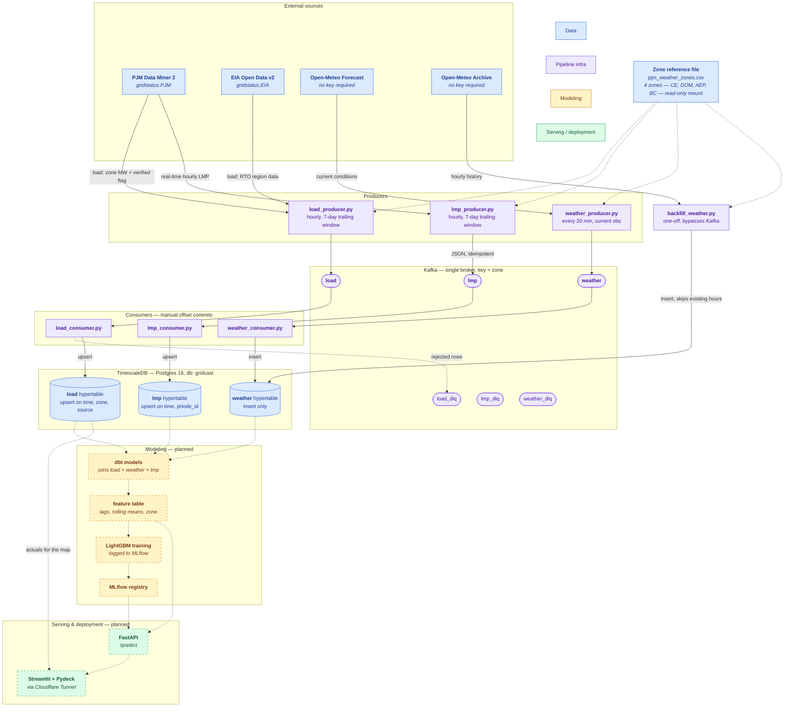

# Data Flow

**Title:** Data flow diagram — sources through storage
**Author:** Angie Ohaeri
**Date:** August 10, 2026 **Time:** 9:10pm

Traces every byte from external API to TimescaleDB, and sketches the not-yet-built modeling path. Solid lines/boxes are implemented today; dashed boxes are planned (`references/architecture.md`). Colors group nodes by role — data, pipeline infra, modeling, and serving/deployment.

---

## End-to-end flow

---

## Orchestration and control plane

Prefect drives every producer and consumer as a scheduled flow. It carries no grid data itself — only run state — and it stores that in a **separate `prefect` database on the same Postgres instance**, never in the hypertables.

The 5-minute producer→consumer offset is deliberate: producers publish at :10, so
consumers at :15 find a drained-and-settled topic rather than racing the write.

---

## Per-source detail

| Source | Endpoint | Cadence | Topic → Table | Write semantics |
|---|---|---|---|---|
| PJM Data Miner 2 | `hrl_load_metered` | hourly, 7-day window | `load` → `load` | upsert on `(time, zone, source='pjm')` |
| EIA Open Data v2 | `electricity/rto/region-data` | hourly, 7-day window | `load` → `load` | upsert on `(time, zone='RTO', source='eia')` |
| PJM Data Miner 2 | `rt_hrl_lmps` | hourly, 7-day window | `lmp` → `lmp` | upsert on `(time, pnode_id)` |
| Open-Meteo Forecast | `/v1/forecast`, `current=` | every 20 min | `weather` → `weather` | append-only |
| Open-Meteo Archive | `/v1/archive`, `hourly=` | manual, one-off | *(none)* → `weather` | direct insert, de-duped against existing hours |

**Why the trailing 7-day window matters:** PJM revises a given hour from unverified to verified over ~3 days, and EIA revises over ~1 day. Re-polling the past week and upserting means those revisions land automatically — the same `(time, zone, source)` row gets overwritten with the corrected number instead of accumulating duplicates. Weather has no revision concept, so it is append-only.

**Frequency alignment:** load and LMP are both hourly here and stamped on **interval end** ("hour ending"), which is what makes them joinable. Weather is sampled on a 20-minute poll clock and is *not* pre-aggregated at ingestion — the resample to hourly happens explicitly in dbt, never silently in a producer.
